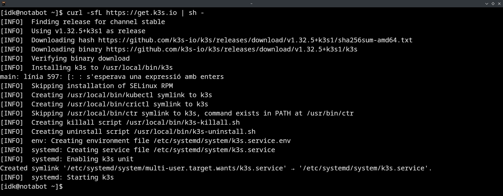
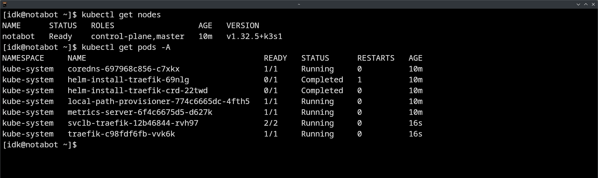
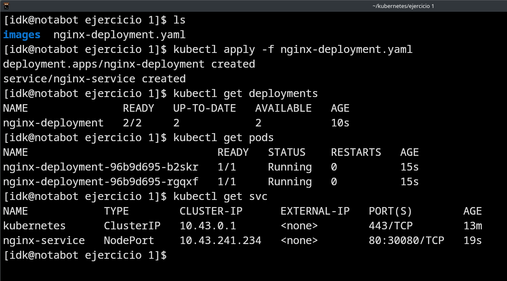
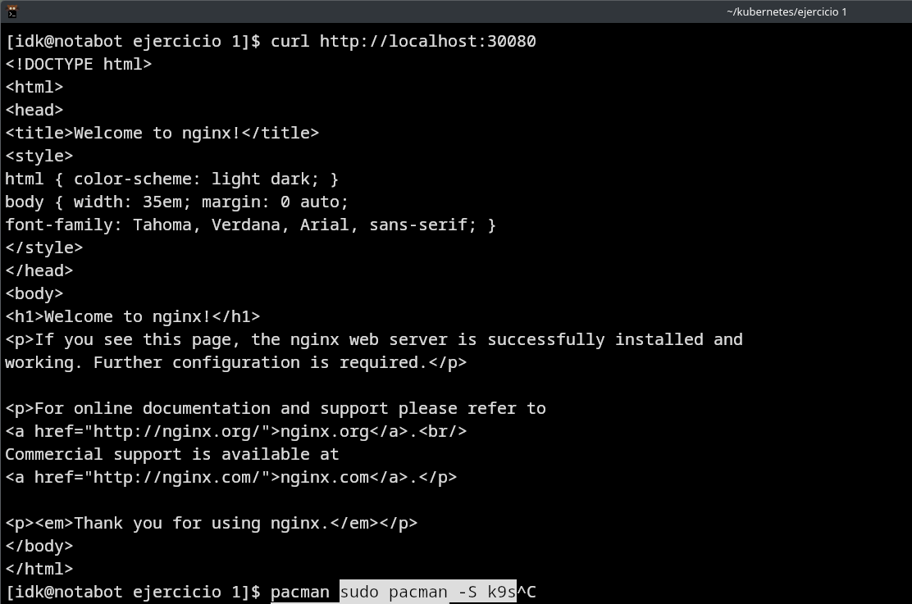
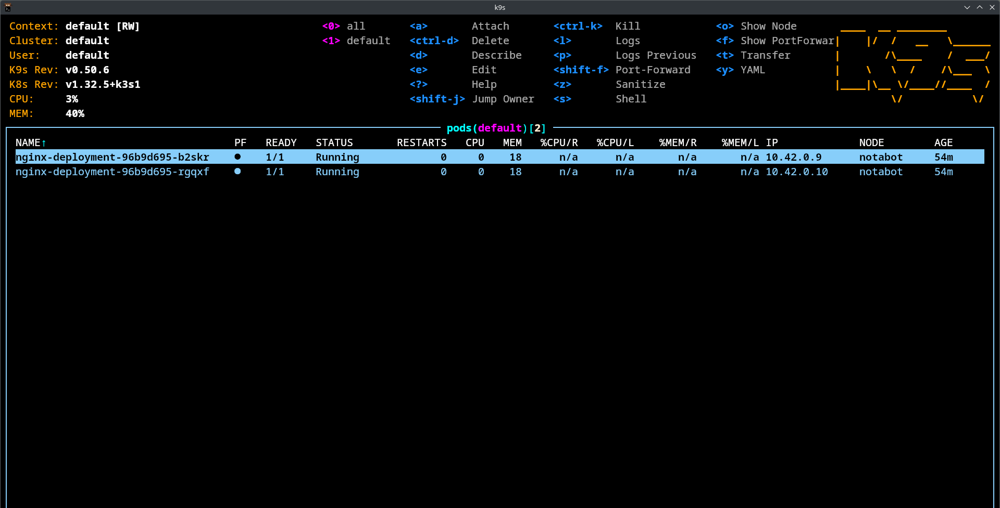

# 🐳 Práctica 3.1.1: K3s en modo Single-Node y despliegue de NGINX

Este repositorio contiene las evidencias correspondientes a la **Práctica 3.1.1** del módulo de *Ciberseguridad en entornos de las tecnologías de la información*. El objetivo es realizar la instalación de **K3s en modo Single-Node**, desplegar un servicio **NGINX con 2 réplicas**, e instalar y validar el funcionamiento de **K9s**.

---

## ⚙️ Instalación de K3s en modo Single-Node

Se ha instalado K3s en un único nodo ejecutando el script oficial desde `get.k3s.io`.

### 📸 Evidencias:

  
> Instalación de K3s mediante el script oficial.

  
> Verificación del estado del servicio `k3s` activo en el sistema.

  
> Verificación del nodo único desplegado.

---

## 📦 Despliegue de NGINX con 2 réplicas

Se ha creado un manifiesto YAML que incluye un `Deployment` con 2 réplicas de NGINX y un `Service` de tipo NodePort para exponerlo externamente.

### 📸 Evidencias:

  
> Manifiesto de despliegue de NGINX con 2 réplicas y exposición por NodePort.

  
> Aplicación del manifiesto, creación de los recursos y revisión de pods y servicios.

  
> Petición HTTP al puerto NodePort del servicio NGINX desplegado.

---

## 🖥️ Validación con K9s

Se ha instalado **K9s** y se ha utilizado para visualizar el estado del clúster y los pods en ejecución.

### 📸 Evidencias:

  
> Validación de que las réplicas NGINX están activas y operativas desde K9s.

---

## 🎯 Objetivo de Aprendizaje

Esta práctica trabaja el resultado de aprendizaje **RA3**:

> "Gestiona sistemas y servicios para la supervisión de la infraestructura y despliegue de aplicaciones seguras."

---

## 🧰 Herramientas utilizadas

- 📦 **K3s** (v1.32.5+k3s1)
- 🔧 **kubectl**
- 📈 **K9s** (v0.50.6)
- 🐧 **Arch Linux**

---

## 📚 Referencias

- 🌐 [K3s - Lightweight Kubernetes](https://k3s.io/)
- 🔎 [K9s - Kubernetes CLI To Manage Your Clusters](https://k9scli.io/)
