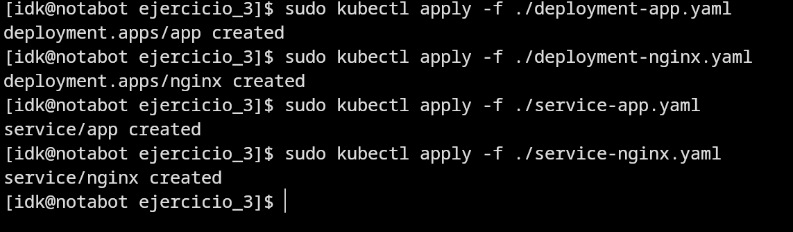
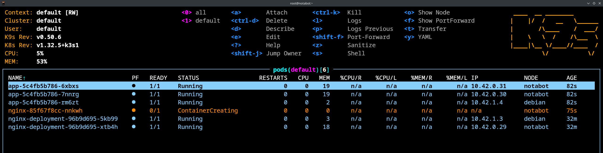
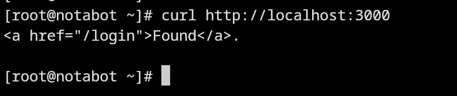

# 🐳 Práctica 5.3: Despliegue de balanceo de carga en K3s y validación con K9s

Este repositorio contiene las evidencias correspondientes a la **Práctica 5.3** del módulo de *Ciberseguridad en entornos de las tecnologías de la información*. El objetivo es desplegar en **K3s** una aplicación basada en un `docker-compose` con balanceo de carga, tal como se describe en el siguiente recurso:

🔗 [Taller Docker - Balanceo de carga](https://aulasoftwarelibre.github.io/taller-de-docker/dockerfile/#balanceo-de-carga)

---

## ⚙️ Despliegue en K3s

Se ha convertido el archivo `docker-compose.yml` en varios manifiestos YAML de Kubernetes, desplegando las siguientes aplicaciones:

- `nginx` como balanceador de carga
- `app` como backend replicado

### 📸 Evidencias:

  
> Ejecución de los comandos `kubectl apply` para desplegar los deployments y servicios definidos.

---

## 🖥️ Validación con K9s

Se ha utilizado **K9s** para comprobar que los pods de las aplicaciones están correctamente ejecutándose en el clúster.

  
> Visualización del estado de los pods, donde se confirman los despliegues del balanceador y la aplicación replicada.

---

## 🔁 Validación del balanceo de carga

Se ha utilizado `curl` para realizar múltiples peticiones HTTP al servicio expuesto, observando que se realiza correctamente el balanceo entre instancias.

  
> Respuesta HTTP del servicio balanceado accediendo al puerto 3000.

---

## 🎯 Objetivo de Aprendizaje

Esta práctica trabaja el resultado de aprendizaje **RA5**:

> "Analiza incidentes de ciberseguridad utilizando herramientas, mecanismos de detección y alertas de seguridad."

---

## 🧰 Herramientas utilizadas

- 📦 **K3s** (v1.32.5+k3s1)
- 🔧 **kubectl**
- 📈 **K9s** (v0.50.6)
- 🐧 **GNU/Linux (Arch y Debian)**

---

## 📚 Referencias

- 📘 [Documentación oficial de K3s](https://k3s.io/)
- 📘 [Kubernetes YAML Generator](https://k8syaml.com/)
- 🔧 [Taller de Docker - Aulasoftwarelibre](https://aulasoftwarelibre.github.io/taller-de-docker/dockerfile/#balanceo-de-carga)
