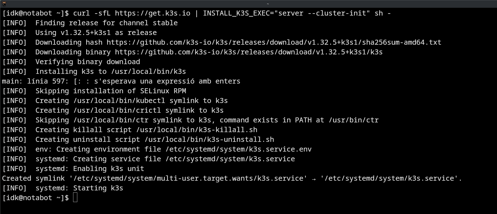
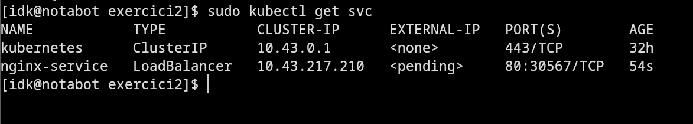
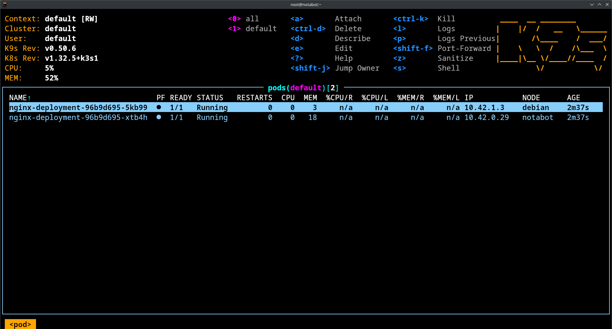
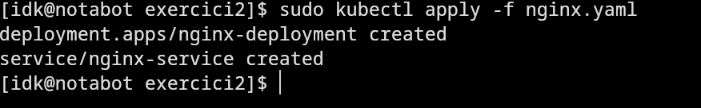
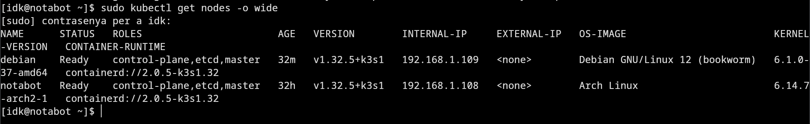

# 🐳 Práctica 5.2: Despliegue de clúster K3s en HA y servicio NGINX

Este repositorio contiene las evidencias correspondientes a la **Práctica RA5.2** del módulo de *Ciberseguridad en entornos de las tecnologías de la información*. El objetivo es realizar la instalación y validación de un clúster **K3s en modo HA**, así como desplegar un servicio **NGINX** con **2 réplicas**, y validar su funcionamiento con **K9s**.

---

## ⚙️ Instalación de K3s en modo HA

Se ha desplegado un clúster K3s en alta disponibilidad utilizando dos nodos:

- `notabot` (Master + etcd)
- `debian` (Master + etcd)

### 📸 Evidencias:

  
> Instalación del nodo `notabot` con parámetro `--cluster-init`.

  
> Unión del nodo `debian` al clúster utilizando `K3S_URL` y `K3S_TOKEN`.

---

## 📦 Despliegue de NGINX con 2 réplicas

Se ha creado un `Deployment` de NGINX con 2 réplicas y un `Service` tipo LoadBalancer para exponerlo.

```bash
kubectl apply -f nginx.yaml
```

### 📸 Evidencias:

  
> Comprobación de que las 2 réplicas están ejecutándose correctamente.

  
> Verificación del servicio `nginx-service` y su asignación de puerto externo (pending si no hay LoadBalancer real).

---

## 🖥️ Validación con K9s

Se ha utilizado la herramienta **K9s** para comprobar visualmente el estado de los pods y su despliegue.

### 📸 Evidencias:

  
> Visualización en K9s del estado de los pods en ejecución.

  
> Exportación de la configuración desde K9s para facilitar el acceso futuro.

  
> Visualización del servicio corriendo correctamente a nivel de interfaz.

---

## 🎯 Objetivo de Aprendizaje

Esta práctica trabaja el resultado de aprendizaje **RA5**:

> "Analiza incidentes de ciberseguridad utilizando herramientas, mecanismos de detección y alertas de seguridad"

---

## 🧰 Herramientas utilizadas

- 📦 **K3s** (v1.32.5+k3s1)
- 🔧 **kubectl**
- 📈 **K9s** (v0.50.6)
- 🐧 **Debian GNU/Linux 12** y **Arch Linux**

---

## 📚 Referencias

- 🌐 [K3s - Lightweight Kubernetes](https://k3s.io/)
- 🔎 [K9s - Kubernetes CLI To Manage Your Clusters](https://k9scli.io/)
